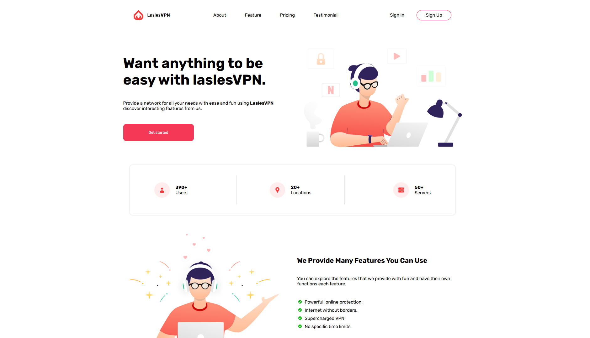

# laslesvpn-landing-page

This is a modern and responsive landing page for a VPN service built using HTML and CSS.

## 🚀 Live Demo

👉 [Live](https://laslesvpn-landing-page-sable.vercel.app/)

## 📸 Screenshots

## ✨ Features

- Responsive design (mobile friendly)
- Clean and modern UI
- Smooth layout structure
- Reusable components (sections)

## 🛠 Technologies Used

- HTML5
- CSS3

## 📁 Project Structure

assets/
 ├── css/
 │    └── style.css
 └── img/
index.html
README.md

## 📦 How to Use

1. Clone the repository:

git clone "https://github.com/MominjonTursunboyev/laslesvpn-landing-page.git"

2. Open project folder:

cd laslesvpn-landing-page

3. Run:

- Open index.html in your browser

## 📌 Notes

This project is created for practice and learning frontend development.

## 📞 Contact

If you have any feedback or suggestions, feel free to reach out.